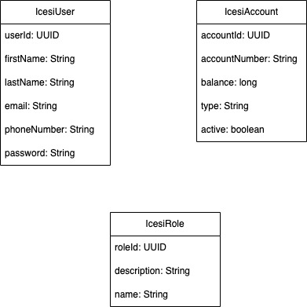
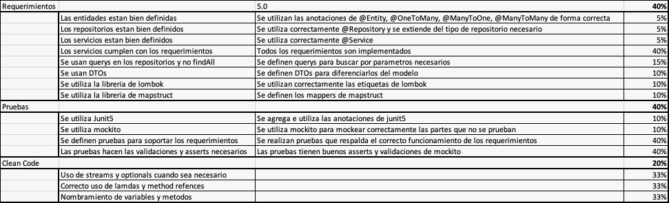

# TallerJPA

# Description

 Your task as a developer of the account system of ICESI University
is to create a service that will handle the creation of users and accounts.

You have a simple model as a base, a user with basic information, the account
entity with details about the number and balance also a type which can be a normal account or a deposit only account.

## Model

- A user can have multiple accounts, and an account belongs to only one user.
- A user can have only one role but multiple users can have the same role.

## Requirements

### Users

- Users should have unique email and phoneNumber, if an user with an existing phone or email is tried to be created it should throw an error with the message description indicating which one of the fields is repeated. if both are in use the message should said that both are in use.
- The user role can't be null.
- User Id is generated by the service

### Roles

- Role name should be unique
- Role Id is generated by the service

### Account

- Accounts marked as deposit only can't transfer or be transferred money, only withdrawal and deposit.
- Accounts balance can't be below 0.
- Accounts number should be unique.
- Accounts number should have the format xxx-xxxxxx-xx where x are numbers [0-9].
- Account number is generated by the service.
- Account Id is generated by the service.
- Account can only be disabled if the balance is 0.

## Requirements

Besides creation of the user, role and account you'll implement the following functions.

- A function in AccountService to enable/disable the account.
- A function in AccountService to withdrawal money.
- A function in AccountService to deposit money.
- A function in AccountService to transfer money to another account.

For testing keep in mind edge cases they can be considered to increase the note. The basic ones are expected to be tested.

## Score
Note that we don't need the controllers right now.
- Is expected that the project runs with the postgres connection if this requirement is not met a penalization of 1.0 will be applied.
- Is expected that the project **runs** without issues. if this requirement is not met a penalization of 1.0 will be applied.
- Names of variables are **IMPORTANT** for each name that doesn't makes sense a penalization of 0.1 will be applied.

### PART 2

## Requirements
- Add security to te application.
- A normal user can only update the state of it's own accounts
- An admin user should be able to create roles, users and assing roles.
- A bank user should be able to create users.

## Testing
- Add a integration test for transfering money
- Add a integration test for user creation

